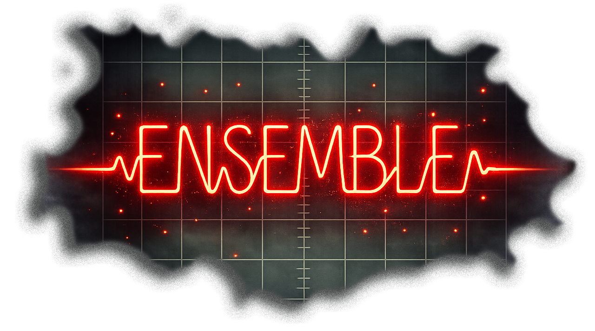

# ENSEMBLE
<br>
  <br>
**A spectral texture forge that transforms live audio into evolving, Penderecki-inspired orchestral swarms.**

ENSEMBLE captures your audio into a circular buffer and continuously re-reads it through 8 voices with golden-ratio panning, incommensurate LFOs, and dual MASS/DUST grain layers — producing dense, breathing string-like textures from any input.

---

## Installation

Download the latest release for your platform from the [Releases](../../releases) page.

**Windows:** Copy the `ENSEMBLE.vst3` folder to `C:\Program Files\Common Files\VST3\`

**macOS:** Copy `ENSEMBLE.vst3` to `~/Library/Audio/Plug-Ins/VST3/`

Rescan plugins in your DAW. ENSEMBLE appears as an audio effect.

---

## How to Use

1. Place ENSEMBLE on an **effects/send track** or your **master bus** — it processes incoming audio, it's not an instrument.
2. Feed audio into it — synths, guitar, vocals, samples, whatever. Play sounds one at a time and let the texture build between each.
3. Dial in the parameters as it plays back to you. Start with defaults and experiment.
4. Press **CLEAR** to wipe the buffer and start fresh whenever you want a clean slate.

## Tips

- Feed sounds in **one by one** in real time. Let each sound layer into the texture before adding the next.
- **Melodic and harmonic sources** work best — pads, guitars, vocals, strings, textural samples. Drums and percussion tend to produce harsh results.
- **PERSIST** controls how long audio stays in the buffer. Higher values build denser, more layered textures over time.
- **BLEND** shifts between pointillist stippling (left) and smeared bowing (right). Try automating it slowly.
- **EVOLVE** controls how much the texture moves on its own. High values create constant internal motion without any input.
- **DRY** mixes your original signal back in. Keep it low for pure texture, or bring it up for parallel processing.
- The **12-band EQ** is great for carving out mud or taming harsh frequencies in the texture.
- The **bandpass filter** (toggle on, then sweep the frequency) can isolate a specific range of the texture for focused, narrow sounds.

---

## Building from Source
# ENSEMBLE — Build & Usage Guide

## Windows Build (Visual Studio 2026)


1. **Delete** your old build folder:
   ```
   rmdir /S /Q C:\ensemble-vst\build
   ```

2. **Replace** the `Source` folder in `C:\ensemble-vst\` with the new `Source` folder from this download.
   Also replace `CMakeLists.txt`.

3. **Make sure** `C:\ensemble-vst\CMakeLists.txt` has this line:
   ```
   set(JUCE_DIR "C:/JUCE" CACHE PATH "Path to JUCE framework")
   ```
 [REPLACE: 
   set(JUCE_DIR "/home/claude/juce" CACHE PATH "Path to JUCE framework")
   WITH:
   set(JUCE_DIR "C:/JUCE" CACHE PATH "Path to JUCE framework")]

4. **Open Developer Command Prompt for VS 2026** and run:
   ```
   cd C:\ensemble-vst
   mkdir build
   cd build
   cmake .. -G "Visual Studio 18 2026" -A x64
   cmake --build . --config Release
   ```

5. **Install:**
   ```
   xcopy /E /I "C:\ensemble-vst\build\Ensemble_artefacts\Release\VST3\ENSEMBLE.vst3" "C:\Program Files\Common Files\VST3\ENSEMBLE.vst3"
   ```

6. Rescan plugins in your DAW.

---

## macOS Build

1. Install Xcode command line tools:
   ```
   xcode-select --install
   ```

2. Install CMake:
   ```
   brew install cmake
   ```

3. Clone JUCE (if you haven't):
   ```
   git clone --depth 1 --branch 8.0.4 https://github.com/juce-framework/JUCE.git ~/juce
   ```

4. Extract `ensemble-vst-plugin.tar.gz` and edit CMakeLists.txt:
   ```
   set(JUCE_DIR "$ENV{HOME}/juce" CACHE PATH "Path to JUCE framework")
   ```

5. Build:
   ```
   cd ensemble-vst
   mkdir build && cd build
   cmake .. -DCMAKE_BUILD_TYPE=Release
   cmake --build . --config Release
   ```

6. Install:
   ```
   cp -r Ensemble_artefacts/Release/VST3/ENSEMBLE.vst3 ~/Library/Audio/Plug-Ins/VST3/
   ```

---

## Controls

### Weave Engine
- **BLEND**: Left = pointillist stippling (DUST), Right = smeared bowing (MASS)
- **TENSION**: Metallic string resonance / comb filter stress
- **TEXTURE**: How loud the weave texture is
- **EVOLVE**: How much the texture moves on its own (LFO depth)

### Mix
- **PERSIST**: Buffer feedback (0.5–0.99). Higher = denser layering over time
- **INPUT**: Input level going into the capture buffer
- **DRY**: Pass-through of your original dry signal
- **OUTPUT**: Master output level

### 12-Band EQ
- Vertical sliders: boost/cut each frequency band (±12 dB)
- **EQ MIX**: Wet/dry for the EQ (0 = EQ bypassed)

### Filter
- **FILTER**: Sweep from Low Pass → Band Pass → High Pass
- **CUTOFF**: Filter frequency. When maxed out, filter is bypassed

### Clear
- **CLEAR** button: Wipes all buffers and starts fresh

---

## Tips

- Press **CLEAR** to reset buffers and start over
- Drums don't work well — this is oriented toward melodic, harmonic, and textural sounds
- Best use case: put ENSEMBLE on your **master bus** and feed multiple sounds into it one by one
- Start with default settings, play something, and let the texture build
- Use **PERSIST** to control how dense the texture gets over time
- Turn **DRY** up if you want to hear your original signal mixed in
- The **Processing Lab** knobs all start at 0 (off) — the core engine is the weave + grains

See [BUILD.md](BUILD.md) for full instructions. Requires JUCE 8.0.4 and a C++ compiler (Visual Studio 2022+ on Windows, Xcode on macOS).
